# Exploring Laptop Price Trends

💻 Dive into the trends of laptop prices with this detailed analysis. This project investigates various factors affecting laptop prices, including processor speed, RAM size, storage capacity, screen size, and weight.

---

## Introduction

This project focuses on analyzing a dataset of laptops to understand trends and patterns in laptop pricing. By examining attributes such as brand, processor speed, RAM size, storage capacity, screen size, and weight, the analysis aims to uncover insights into how these features influence laptop prices.

---

## Dataset Description

The dataset comprises 1000 rows and 7 columns, each representing different attributes related to laptops.

| #   | Column               | Description                                               |
| --- | -------------------- | --------------------------------------------------------- |
| 1   | **Brand**            | Manufacturer or brand name (Asus, Acer, Lenovo, HP, Dell) |
| 2   | **Processor_Speed**  | Clock speed of the processor in GHz                       |
| 3   | **RAM_Size**         | Amount of RAM installed in GB                             |
| 4   | **Storage_Capacity** | Total storage capacity in GB                              |
| 5   | **Screen_Size**      | Diagonal display size in inches                           |
| 6   | **Weight**           | Physical weight of the laptop in kilograms                |
| 7   | **Price**            | Retail price of the laptop                                |

### Data Quality

- **Missing Values**: The dataset contains no missing values.
- **Duplicates**: The dataset contains no duplicate values.
- **RangeIndex**: The dataset includes 1000 entries.
- **Data Types**: 4 float columns, 2 integer columns, and 1 object column.

---

## Analysis Steps

### Step 1 | Python Libraries

Setting up the environment with required libraries and configurations.

### Step 2 | Preparing the Dataset

Loading the data and performing an initial overview of attributes, data types, and statistical summaries.

### Step 3 | Data Preprocessing

**3.1 | Columns Formatting**

**3.2 | Missing Value Handling**

A missingness matrix confirms the dataset is completely clean — all 1000 entries across all 7 columns are present:

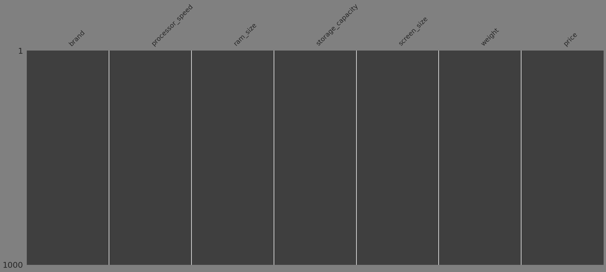

**3.3 | Duplicate Value Management**

**3.4 | Precision Adjustment: Rounding**

---

### Step 4 | Exploratory Data Analysis

**4.1 | Individual Variables Analysis**

The five brands are nearly evenly distributed, with Dell slightly leading at 21% and HP and Lenovo tied at the lowest at 19%:

|                                                       |                                                             |
| ----------------------------------------------------- | ----------------------------------------------------------- |
|  | 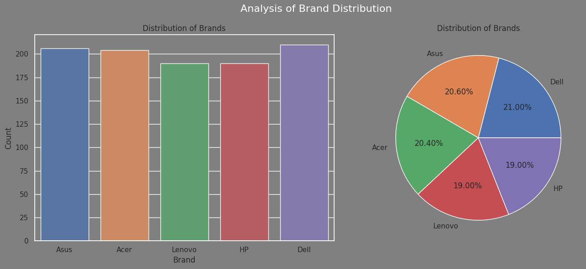 |

Histogram distributions with density curves for all six numeric features — processor speed shows a relatively flat spread across 1.5–4.0 GHz, while RAM and storage cluster at discrete tiers:

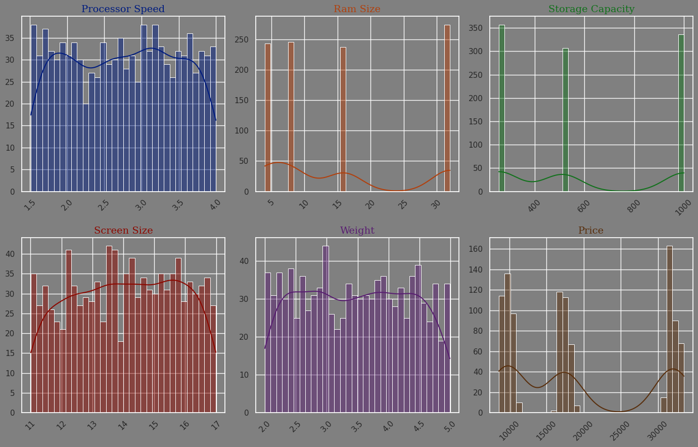

KDE curves reveal that RAM size and storage capacity have clear multimodal patterns, confirming that values come in fixed tiers rather than as a continuous range:

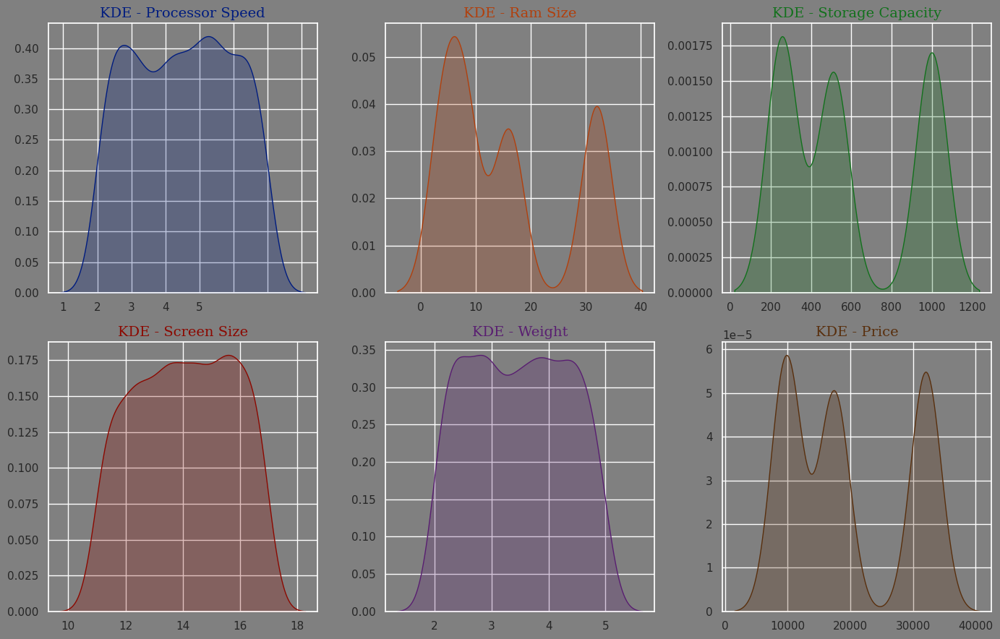

**4.2 | Outlier Identification**

Box plots across all features show that processor speed, screen size, weight, and price have no outliers, while RAM and storage show visible spread consistent with their discrete tier structure:

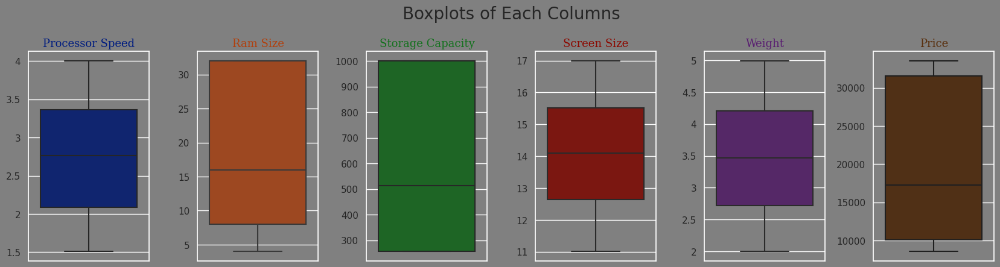

**4.3 | Pairs of Variables Insights**

Scatter plots of each feature against price reveal that price exists at three distinct tiers (~10k, ~18k, ~32k), and no single continuous feature drives a smooth price gradient:

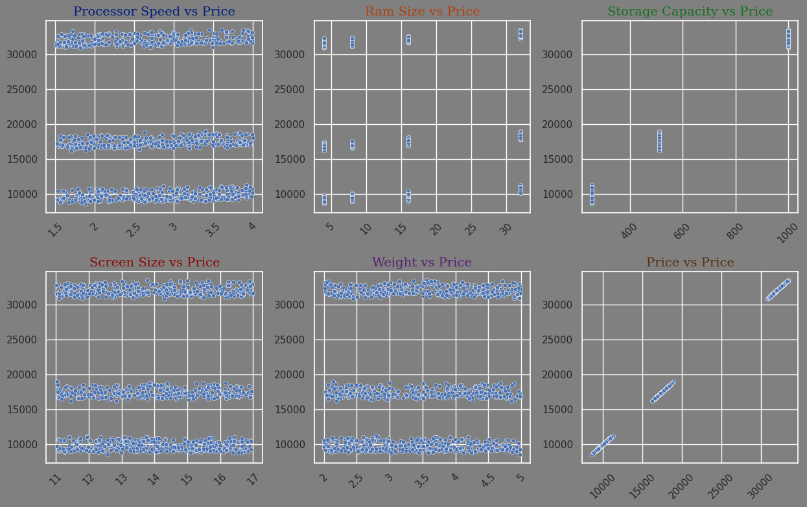

Box and scatter plots paired per feature confirm these discrete price bands hold consistently regardless of processor speed, screen size, or weight:

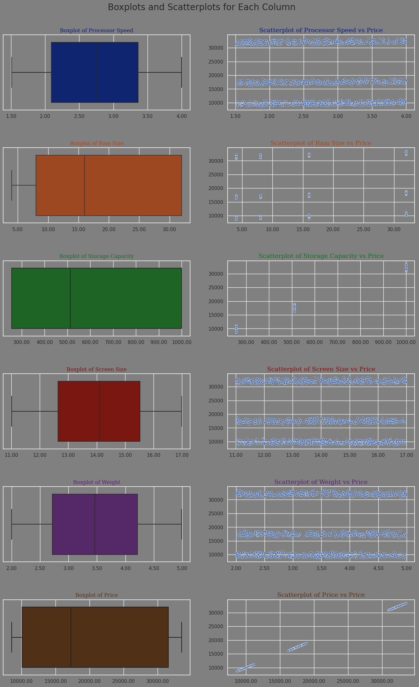

**4.4 | Multiple Variables Examination**

The correlation heatmap shows that storage capacity has a near-perfect correlation with price (1.00), making it the dominant pricing factor. All other features have correlations close to zero:

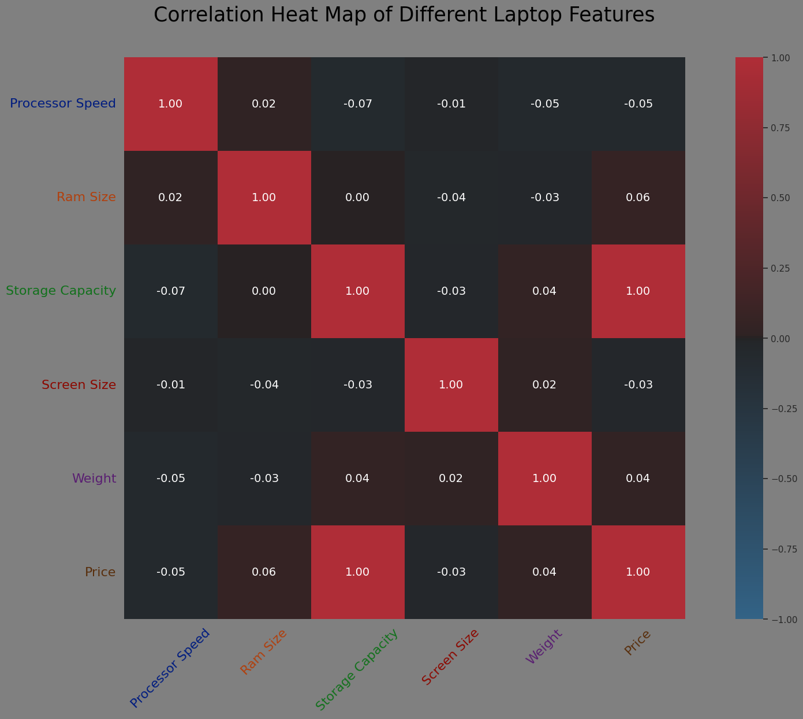

Scatter plots with regression lines reinforce the correlation findings — storage capacity traces a clean linear relationship with price, while all other features show horizontal bands with flat regression slopes:

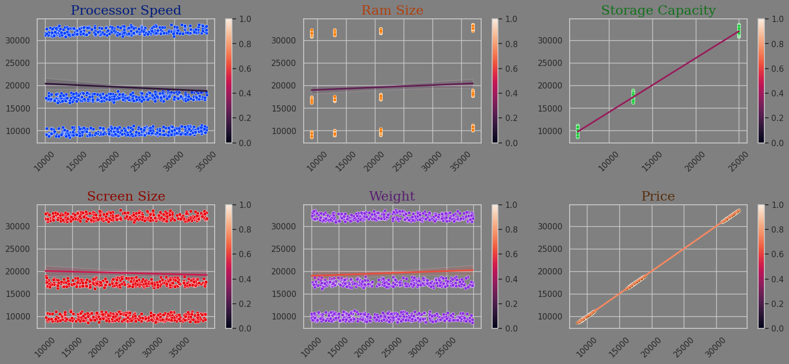

The pairplot gives a full cross-feature view, colored by brand, confirming that brand has no meaningful impact on how features distribute or relate to each other:

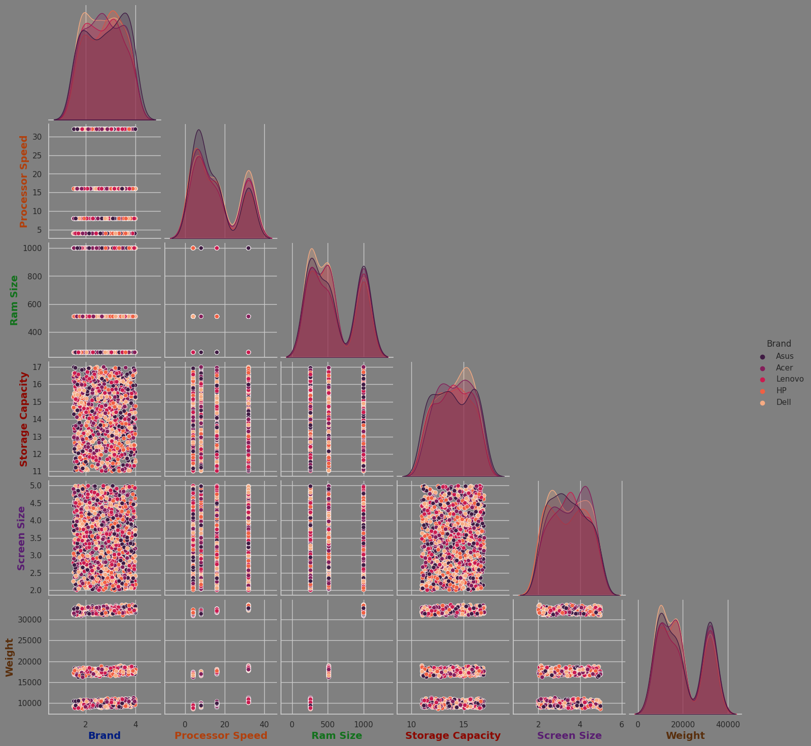

A 3D scatter of Price, Processor Speed, and RAM Size visualizes the discrete pricing tiers in three dimensions — the horizontal layering confirms that neither processor speed nor RAM alone determines price tier:

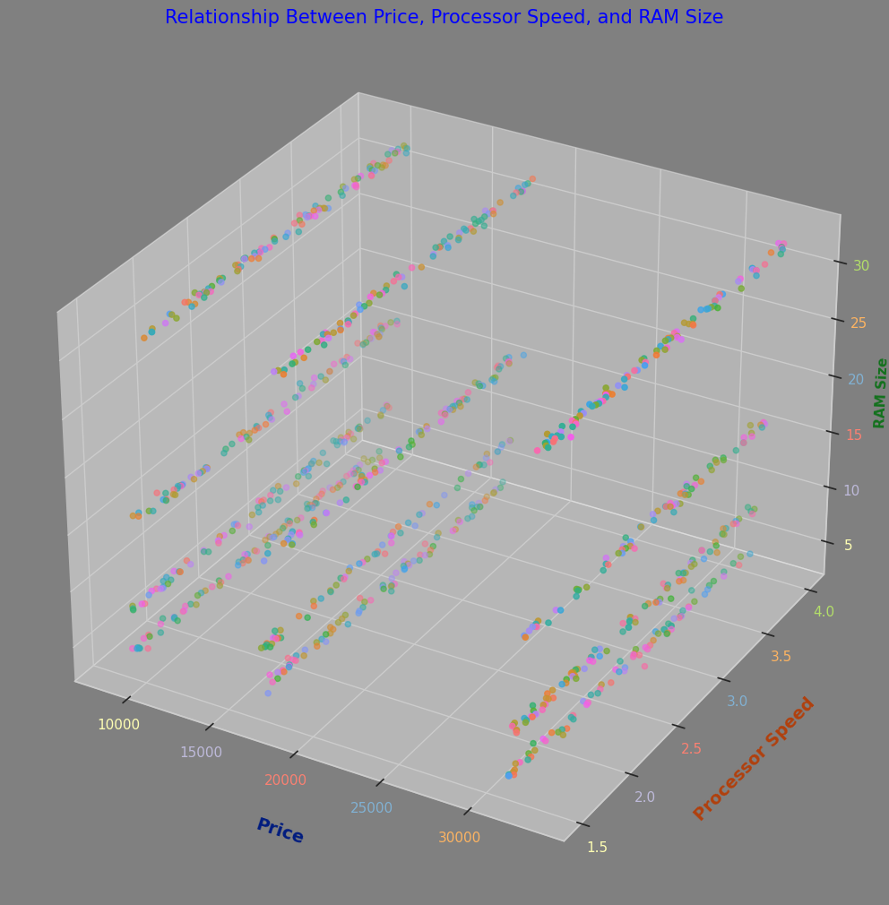

Faceted relplot of RAM Size vs Price broken out by storage capacity tier shows that price tier is entirely determined by storage (256 → ~10k, 512 → ~18k, 1000 → ~32k), regardless of RAM or brand:

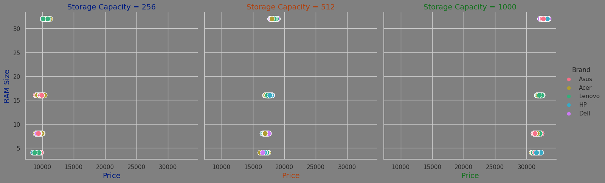

**4.5 | Hypothesis Testing with ANOVA**

ANOVA was used to test whether mean prices differ significantly across brands. Results confirm that brand is not a statistically significant predictor of price in this dataset.

---

### Step 5 | Model Development & Evaluation

**5.1 | Data Normalization**

**5.2 | Feature Encoding**

**5.3 | Model Training**

**5.4 | Model Evaluation**

**5.5 | Hyperparameter Tuning**

R² score vs value of K for KNN regression — the model peaks around K=3–5 and plateaus with near-perfect scores above 0.9995 across most values of K:

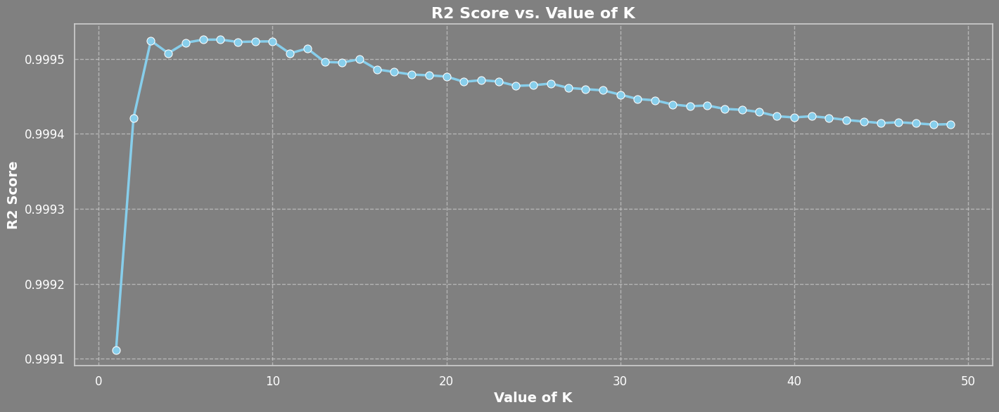

**5.6 | Best Model Result**

KNN regression achieved an R² score exceeding 0.9995, indicating that storage capacity alone is nearly sufficient to predict price with very high accuracy.

**5.7 | Interactive Model Testing**

An interactive widget allows users to input laptop specifications and receive a predicted price from the trained model in real time.

---

## How to Use This Repository

1. **Clone the Repository**: `git clone https://github.com/msjahid/laptop_price.git`
2. **Navigate to the Project Directory**: `cd laptop_price`
3. **Explore the Data**: The dataset is available in the `laptop_data` folder. Load and explore it using your preferred data analysis tools.
4. **Run the Analysis**: Use the provided Jupyter notebooks to perform analyses and visualize the findings.

---

## Contributing

Contributions are welcome! Please fork the repository and create a pull request with your changes. For major changes, please open an issue first to discuss what you would like to change.

---

## Contact

If you have any questions or suggestions, feel free to reach out at [ms_jahid@yahoo.com].
